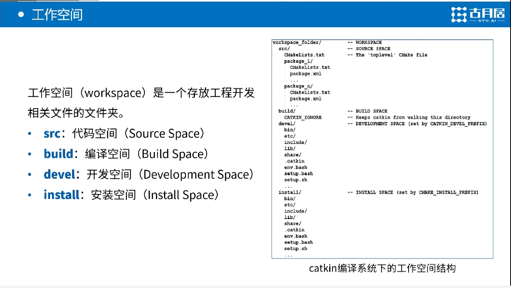
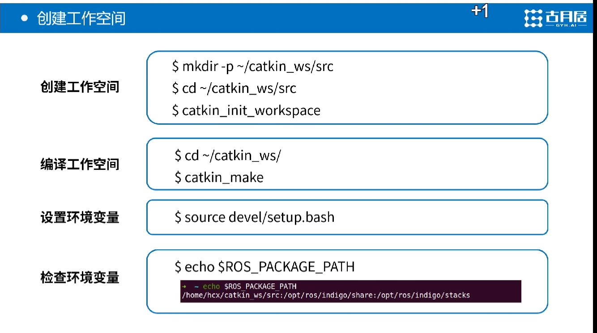
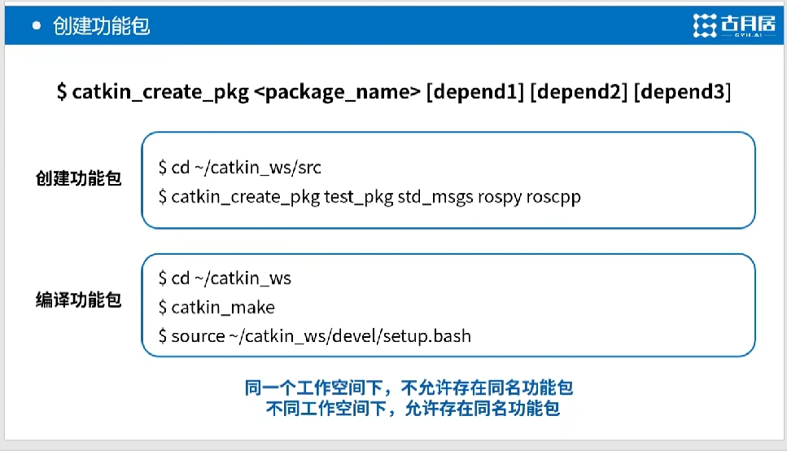
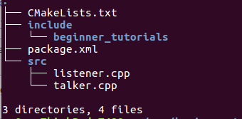

# ROS学习

## ROS介绍

- __推荐网站__
  - https://www.ncnynl.com/archives/201608/497.html
  - [官方](http://wiki.ros.org/cn/ROS/Tutorials)    __推荐将做个文档好好看一遍__
  - [ros优缺点分析](https://blog.csdn.net/heyc861221/article/details/80123570)

## ROS安装遇到的问题及解决方案

__环境__:__ubuntu16.04.4 LTS__

- __问题_1__:运行sudo apt-get install ros-kinetic-desktop-full 后就会提示无法解析安装源。

  - __解决方法__

    ```shell
    首先我检查了一下我的域名： sudo gedit /etc/resolv.conf   显示nameserver 127.0.1.1 本地回路地址好像是正确的。
    
    打开自己的发软和更新，可从互联网下载都打上勾：
    
    我觉得最主要的问题是要添加一个合适的软件源，于是我就去ROS官网找答案：http://wiki.ros.org/kinetic/Installation
    
    点击ubuntu,点击Mirrors，就会看到相关源，我选择的是第三个源：
    
    运行这行命令：
    
    sudo sh -c '. /etc/lsb-release && echo "deb http://ros.exbot.net/rospackage/ros/ubuntu/ $DISTRIB_CODENAME main" > /etc/apt/sources.list.d/ros-latest.list'
    或者用中科大的源
    
    sudo sh -c '. /etc/lsb-release && echo "deb http://mirrors.ustc.edu.cn/ros/ubuntu/ $DISTRIB_CODENAME main" > /etc/apt/sources.list.d/ros-latest.list'
    可以运行：sudo gedit /etc/apt/sources.list看看里面的内容是不是如下：
    
    deb http://archive.ubuntu.com/ubuntu xenial main universe restricted multiverse
    deb-src http://archive.ubuntu.com/ubuntu xenial main universe restricted multiverse #Added by software-properties
    deb http://security.ubuntu.com/ubuntu/ xenial-security main restricted multiverse universe
    deb http://archive.ubuntu.com/ubuntu xenial-updates main restricted multiverse universe
    
    如果不一样，可以复制粘贴进去，保存关闭后：
    
    sudo apt-get update
    
    我的情况就是这样，成功找到ROS kinetic。后续安装请参考http://blog.csdn.net/zhangrelay/article/details/51364622
    
    ```
  
- __剩下的根据下面的网址走起即可__:<https://blog.csdn.net/zhangrelay/article/details/51364622> 


## ROS实战

### 创建ROS程序包

- __首先创建工作空间__

  

  

  

  

- __创建功能包也就是程序包__

  

  

- `现在使用`catkin_create_pkg`命令来创建一个名为'beginner_tutorials'的新程序包，这个程序包依赖于std_msgs、roscpp和rospy`：

  ```shell
  catkin_create_pkg beginner_tutorials std_msgs rospy roscpp
  ```

  

  如图ros帮我们建立的目录结构主要说明一下[package.xml](<http://wiki.ros.org/catkin/package.xml>)这个文件:他主要记录了我们这个程序包所依赖的程序包

  然后我们可以尝试用c++写一个发布者和订阅者两个cpp然后修改CMakeLists.txt  然后bulid  cmake  ..    make 就会ok 生存的可执行文件会在build下的devel/lib下面

  c++例子[http://wiki.ros.org/cn/ROS/Tutorials/WritingPublisherSubscriber%28c%2B%2B%29](http://wiki.ros.org/cn/ROS/Tutorials/WritingPublisherSubscriber(c%2B%2B))

  

  

  ### ROS的消息和ROS服务
  
  - __定义介绍__
    - 消息： msg文件就是一个描述ROS中所使用消息类型的简单文本。它们会被用来生成不同语言的源代码
  - 服务:一个srv文件描述一项服务。它包含两个部分：请求和响应
  - 具体学习<http://wiki.ros.org/cn/ROS/Tutorials/CreatingMsgAndSrv#Common_step_for_msg_and_srv>

  

  ### roslaunch文件介绍

  - [http://ttshun.com/2018/05/24/ROS%E5%AD%A6%E4%B9%A0%E4%B9%8Broslaunch/](http://ttshun.com/2018/05/24/ROS学习之roslaunch/)
  
  